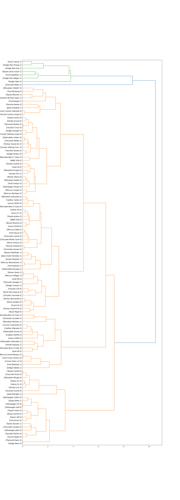

# Análisis de Clustering y Segmentación de Vehículos y Clientes

## Resumen del Análisis

En este proyecto se realizó un análisis de clustering utilizando datos de vehículos y clientes para identificar grupos con características similares. Se aplicaron técnicas de normalización, cálculo de distancias, clustering jerárquico y aglomerativo, y se generaron visualizaciones para interpretar los resultados.

---

## Segmentación de Clientes (K-Means)

- Segmentación en 3 clusters basada en Edad, Educación e Ingreso.
- Visualización 2D y 3D para entender agrupamientos.

### Visualización 2D de Segmentación de Clientes

### Visualización 3D de Segmentación de Clientes

---

## Análisis y Clustering de Vehículos

- Limpieza y normalización de variables relevantes.
- Cálculo de matriz de distancias euclidianas.
- Clustering jerárquico y aglomerativo para agrupar vehículos.
- Asignación de clusters en el dataset.

### Dendrograma de Clustering Jerárquico

### Scatter Plot de Clusters de Vehículos

Eje X: Potencia (`horsepow`)  
Eje Y: Consumo (`mpg`)  
Tamaño: Precio (`price`)  
Color: Cluster asignado  
Modelo etiquetado para cada punto.

---

## Conclusión

El análisis permitió identificar grupos homogéneos de clientes y vehículos, facilitando estrategias de segmentación y marketing personalizado.

---

## Cómo ejecutar

Ejecuta el notebook `machine_learning.ipynb` con las librerías necesarias instaladas para reproducir el análisis y generar los gráficos.
